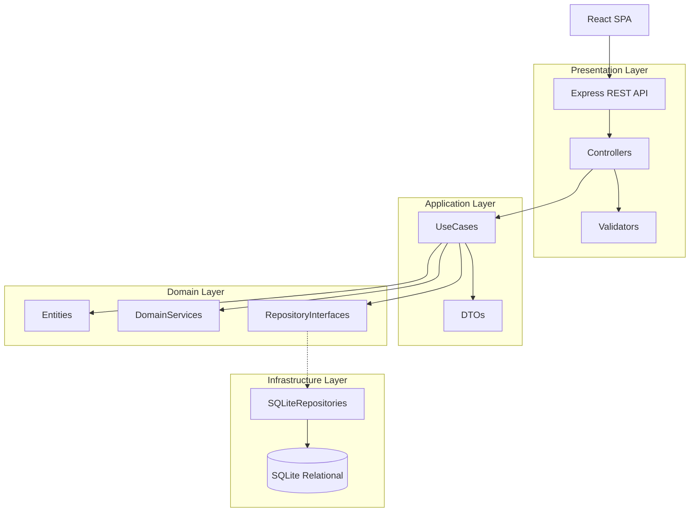

# Enterprise Refactoring Plan & Architecture Report

## 1. Architecture Diagram

## 2. Current State Analysis
The current application consists of:
- A massive **14,000+ line monolithic `src/App.tsx`** handling UI, local state, and routing.
- A client-side data service (`src/services/dataService.ts`) which stores entire tables as JSON arrays.
- A simple Express backend (`server.ts`) that persists these JSON arrays as Key-Value strings in SQLite.
- Currently, "Sales" and "Inventory Movements" are separated logically in the client-side stock recalculation (`recalculateAllWarehouseStocks`), but they lack enforcement at the database level.

## 3. Improvement & Refactoring Plan (Incremental Steps)
To avoid breaking the UI and existing systems, this refactoring must be incremental:

### Phase 1: Relational Database Migration (Infrastructure)
1.  **Define SQLite Schemas**: Move away from Key-Value JSON blobs to normalized tables (`items`, `warehouses`, `inventory_ledgers`, `sales_orders`, etc.).
2.  **Create Migration Scripts**: Write a script to convert the existing `database.json` / Key-Value store into the relational schema.

### Phase 2: Backend Clean Architecture Implementation
1.  **Setup Clean Architecture Folders**: `domain/`, `application/`, `infrastructure/`, `presentation/`.
2.  **Build RESTful Controllers & Use Cases**: Implement transaction-safe endpoints for documents.
    - Implement `InventoryLedger` with strictly immutable rows to calculate `PhysicalQuantity`, `ReservedQuantity`, and `AvailableQuantity`.
3.  **Implement Server-Side Validations**: Prevent direct quantity edits.

### Phase 3: Client-Side De-Coupling
1.  **Refactor `App.tsx`**: Extract the monolith into modular React components (e.g., `features/sales`, `features/inventory`).
2.  **Wire UI to New REST APIs**: Replace the `getLocalData`/`saveLocalData` syncing arrays with modern CRUD interactions.

## 4. Breaking Changes & Compatibility
- **Current API**: The `/api/data/:key` endpoints will eventually be replaced by targeted REST endpoints (`/api/v1/sales-orders`, `/api/v1/inventory/ledger`). 
- **Backward Compatibility**: During the transition, we will keep the `/api/data/:key` endpoints functioning as legacy adapters.

## 5. TODO List For Next Steps
- [ ] Initialize actual SQLite migration scripts (DDL statements for entities).
- [ ] Create base Domain Entities (`Warehouse`, `Product`, `InventoryLedger`).
- [ ] Create a `Drizzle` or `Knex` configuration if ORM is desired, or raw SQLite repos.
- [ ] Begin breaking down `src/App.tsx` into smaller chunks. 

*Please confirm if you would like me to proceed with Phase 1 (Database Migration & Infrastructure) next!*
